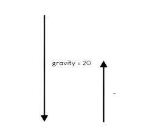

# **`2_images_&_surfaces`**
## **image convert**
```python
background = pygame.image.load("image/background-day.png").convert()
background = pygame.transform.scale2x(background)
```
`transform.scale2x(background)` : `background` 표면을 가져와 크기를 두배로 늘리고 이 변수를 스케일된 표면으로 덮어씁니다.

두 문장 코드를 `background = pygame.transform.scale2x(pygame.image.load("image/background-day.png"))` 의 형태로 한 줄로 작성할 수도 있지만 두 줄로 작성한 코드의 경우가 더 깨끗해보이기 때문에 두 줄로 작성하였습니다.

<br>

라인의 끝에 붙여진 `convert()` 는 꼭 필요한 작업은 아니지만 이미지를 변환하는 작업을 pygame용으로 작업하기 더 쉬운 파일 유형으로 변환해줍니다.

기본적으로 pygame에서 게임을 더 쉽게 실행할 수 있꼬 더 빠른 속도로 게임을 실행할 수 있게 해주지만, 코드를 실행했을 때 `convert()` 에 대한 표현이 가시적으로 나타나진 않습니다.

하지만 게임이 더 복잡해지고 바빠지면 `convert()` 를 통해 더 일관된 속도로 게임을 실행하는 데 도움이 될 수 있습니다.

<br>

## **floor process**
```python
def draw_floor():
    screen.blit(floor_surface,(floor_x_pos, screen_height - floor_height))
    screen.blit(floor_surface,(floor_x_pos + screen_width, screen_height - floor_height))
```
첫번째 `floor_surface` 가 끝나는 지점에 또 하나의 `floor_surface` 를 추가하여 아래 코드의 `floor_x_pos -= 1` 과 호환성을 이룹니다.
```python
floor_x_pos -= 1
```
`floor_x_pos -= 1` 은 `while`문 내에 있기 때문에 매 `tick(n)` 마다 floor 가 왼쪽으로 이동하는 애니메이션 효과를 냅니다. fps 가 높을 수록 더 자연스럽습니다.
```python
if floor_x_pos <= -floor_width:
        floor_x_pos = 0
```
`floor_x_pos` 이 `-floor_width(-576)` 이면 다시 `floor_x_pos` 을 x 좌표 0 으로 이동시켜 `floor` 가 이동하는 애니메이션 효과가 끊기지 않도록 합니다.

이 동작은 너무 빠르기 때문에 우리는 실제로 전환을 볼 수 없으며 매우 자연스러운 애니메이션 효과를 냅니다.

<br>

# **`3_bird process`**
## **get_rect()**
```python
bird_rect = bird_surface.get_rect(center = (100, screen_height / 2))
```
`get_rect()` 는 불러온 표면(surface) 주위에 직사각형을 배치하고 전달하는 인수에 따른 결과를 출력하는 것입니다.

이 코드에서는 사각형에서 한 점을 잡는데, 그 점은 중심(center)이며, x 와 y 위치 할당된 튜플(왼쪽에서 100px, 화면중앙에 놓을 것이므로 screen_height / 2 )을 통해 표면의 너비와 높이를 갖는 직사각형을 갖고, 이 직사각형의 중심은 이 튜플 안의 좌표 점에 있습니다.

<br>

## **Bird Jump process**
```python
if event.type == pygame.KEYDOWN:
            if event.key == pygame.K_SPACE:
                bird_movement = 0
                bird_movement -= 12
```
`bird_movement -= 12` 를 통해 키 입력 시 새가 12px 만큼 점프하게 만듭니다. pygame 에서는 y 값이 위에서 아래로 향할 수록 양수가 되기 때문에 음수값을 연산해서 점프하는 것 처럼 보이게 할 수 있습니다.

점프력 픽셀값인 `-12` 를 더하기 전에 `bird_movement = 0` 을 먼저 정의하는 것은 새의 점프가 중력값에 영향을 받지 않도록 하기 위함입니다.



만약 계속해서 0.25씩 증가하는 중력값에 -12 를 연산하면 n초 간 쌓인 중력값 만큼에서 -12 를 연산하기 때문에 정확히 -12px 만큼 점프할 수 없습니다.

새의 점프가 중력에 영향을 받지 않는 이질적인 움직임을 작동하기 위해서 `bird_movement = 0` 으로 거듭해서 더해진 중력값을 초기화를 한 후 -12px 를 움직이게 하면 쌓인 중력값이 얼마였던간에 새가 정확히 -12px 을 점프할 수 있게됩니다.

<br>

# **`4_pipes_process`**
## **USEREVENT 및 파이프 생성의 기본 구성**
```python
pipe_list = []
SPAWNPIPE = pygame.USEREVENT
pygame.time.set_timer(SPAWNPIPE, 1200) # 1200ms   => 1.2s
pipe_height = [400, 600, 800]
```
`pipe_list = []` 는 게임 내에서 지속적으로 등장할 파이프들의 좌표값을 받아주게 됩니다. 아래에서 만들어지는 함수들의 동작이 이 리스트에 입력되어 화면 상에 파이프를 나타나게 만듭니다. 

`USEREVENT` 를 가지는 변수(SPAWNPIPE)의 이름을 대문자로 기입한 것은 그저 Python 에서의 관례입니다.

`SPAWNPIPE` 이벤트는 event loop 에서 키 입력을 통해 트리거된다는 점을 제외하면 기본적으로 똑같이 동작하지만, `USEREVENT` 의 경우에는 `time` 함수를 통해 지정한 시간마다 이벤트가 자동 발생하는 형식입니다.

`pipe_height` 리스트에 `400`, `600`, `800` 의 y 좌표로 사용될 인수들을 저장한 뒤 `random` 함수를 통해 화면에서 이 3가지 높이의 파이프가 랜덤하게 등장할 수 있도록 하는 logic 이 구성된 함수를 생성합니다.

<br>

## **무작위 높이의 상.하단 파이프 생성**
```python
def create_pipe():
    random_pipe_pos = random.choice(pipe_height)
    bottom_pipe = pipe_surface.get_rect(midtop = (screen_width + 100, random_pipe_pos))
    top_pipe = pipe_surface.get_rect(midbottom = (screen_width + 100, random_pipe_pos - 300))
    return bottom_pipe, top_pipe
```
`random.choice()` 의 인수에 `pipe_height` 을 넣어서 무작위로 `400`, `600`, `800` 의 인수들을 불러올 수 있습니다.

여기서 불러온 값을 통해 파이프 간 거리 300px 을 벌려둔 채 생성되는 하단과 상단의 파이프를 생성합니다.

<br>

## **파이프 화면 이동 함수**
```python
def move_pipes(pipes):
    for pipe in pipes:
        pipe.centerx -= 5
    return pipes
```
파이프의 중심 x 좌표를 지속적으로 -5px 씩 깎으면서 화면 왼쪽으로 밀어냅니다.

주의할 점은 여기서 화면 바깥으로 밀려난 파이프들은 이 함수 동작만으로는 사라지지 않고 화면 바깥에 계속해서 존재하며, x 좌표값이 음수로 무한히 늘어나는 상태를 유지하며 게임이 끝날 때 까지 존재합니다.

이는 하나의 게임이 오랫동안 지속될 수록 게임의 렉을 증가시키며, 렉이 `SPAWNPIPE` 의 1200ms 마다 생성되는 함수와 곂쳐서 점점 파이프 사이의 간격이 좁아지는 버그를 유발합니다.

<br>

## **상단 파이프 표면 이미지 뒤집기(transform.flip)**
```python
def draw_pipes(pipes):
    for pipe in pipes:
        if pipe.bottom >= screen_height:
            screen.blit(pipe_surface, pipe)
        else:
            flip_pipe = pygame.transform.flip(pipe_surface, False, True)
            screen.blit(flip_pipe, pipe)
```
도트 바닥이 1024 보다 크거나 같은 경우에는 일반적인 파이프 표면 이미지(하단 파이프)를 `screen.blit` 합니다.

하지만 이 조건을 충족하지 못하는 파이프는 `transform.flip` 을 통해 표면을 뒤집어 생성하고, 이렇게 생성된 뒤집힌 파이프 표면 이미지는 상단 파이프에 사용됩니다.

`flip` 은 표면 이미지를 뒤집는 기능이며, 2개의 인수(첫번쨰 인수 : x 방향으로 뒤집기, 두번째 인수 : y 방향으로 뒤집기)를 가집니다.

<br>

## **SPAWNPIPE in event loop**
```python
for event in pygame.event.get():
    if event.type == pygame.QUIT...
    
    if event.type == pygame.KEYDOWN...

    if event.type == SPAWNPIPE:
        pipe_list.extend(create_pipe())
```
`SPAWNPIPE` 이벤트 logic 에서 `pipe_list` 에 `append` 가 아닌 `extend(확장)` 를 하는 이유는 `create_pipe()` 의 반환값은 **쉼표로 구분된 변수로 돌아가기 때문에 튜플을 반환**하므로 `append` 를 하기 위해서는 이 튜플의 압축을 풀거나 최소한 다른 작업을 수행해야 하므로 다른 목록에 추가할 수 없기 때문에 `extend(확장)` 을 통해 추가되는 모든 것을 가져옵니다.

# **`5_collisions`**
## **충돌 범위 지정 시 `==` 가 아닌 `<=` 혹은 `>=` 를 사용하는 이유**
```python
def check_collision(pipes):
    for pipe in pipes:
        if bird_rect.colliderect(pipe): # ture 를 반환하므로 if 를 사용할 수 있음
            return False

    if bird_rect.top <= -100 or bird_rect.bottom >= 900:
        return False

    return True # 2개의 트리거 중 어느 것도 트리거하지 않으면 true를 반환 
```
비디오 게임에서는 정확한 픽셀 측정값을 얻는 경우가 매우 드뭅니다.


예를 들어 `if`문에서 제시한 `bird_rect.bottom`은 정확히 `900` 위치에 있지만 실제 움직임에 따른 좌표의 변화는 그 지점보다 약간 높거나 낮을 가능성이 훨씬 높기 때문에 정확히 맞지 않을 수 있습니다.

<br>

## **게임 재시작 logic**
```python
        if event.type == pygame.KEYDOWN:
            if event.key == pygame.K_SPACE and game_active == True:
                bird_movement = 0
                bird_movement -= 12
            
            # restart
            if event.key == pygame.K_SPACE and game_active == False:
                game_active = True
                pipe_list.clear()
                bird_rect.center = (100, screen_height / 2)
                bird_movement = 0
```
게임 재시작 시 `bird_movement = 0` 값을 할당하지 않으면 `bird_movement += gravity` 값이 계속해서 쌓이며 새가 제어할 수 없을 정도의 속도로 하강해버리는 버그가 발생하기 때문에 재시작과 동시에 새의 움직임도 초기화를 시켜주어야 합니다.

<br>

# **`6_rotating_animating_bird`**
## **pygame rotation**
pygame 에서 무언가를 **회전할 때 품질이 약간 손실**된다는 점을 기억해야 합니다. 하지만 한 번만 회전하면 괜찮습니다.

다른 표면은 전혀 회전하지 않은 원본이고 다른 하나는 회전되고 모든 단일 회전은 항상 원래 지점에서 시작하므로 실제로 **한 번만 회전하면 품질이 저하되지 않습니다.**

<br>

## **rotated the bird process**
```python
def rotate_bird(bird):
    new_bird = pygame.transform.rotozoom(bird, - bird_movement * 3, 1)
    return new_bird
```
위 함수를 통해 상승과 하강에 따른 새의 표면 이미지 회전을 정의합니다. 중력(gravity)과 새 점프(K_SPACE)에 의한 좌표 이동 영향을 받는 `bird_movement` 변수를 통해 이미지의 회전율을 제어합니다.

`rotozoom` : 표면의 크기를 조정하고 회전할 수 있는 두 가지 작업을 수행하지만 이 코드에서는 세 번째 인수인 크기(scale) 조정은 사용하지 않습니다.

`bird_movement` 에 `3` 을 곱한 이유는 새의 움직임의 변화를 더 크게하여 단순히 역동성을 높이기 위함입니다. 역동성이 크지 않으면 회전하는 모습이 크게 눈에 띄지 않습니다.
     
```python
if game_active:
        # bird
        ...
        rotated_bird = rotate_bird(bird_surface)
        screen.blit(rotated_bird, bird_rect)
        ...
```
`game_active` 구문에서도 `회전된 새(rotated_bird)` 변수를 새로 추가하여 기존의 새의 `screen.blit` 에 할당되어 있던 `bird_surface` 를 `rotated_bird` 로 수정했습니다.


이 상태에서 프로그램 오버런을 하면 새 주변에 검은색 직사각형이 생긴 것을 확인할 수 있는데, 이것은 `rotate_bird()` 함수를 통해 새로운 새 표면을 만들 때 새로운 표면에는 다른 값이 없기 때문입니다.

```python
bird_surface = pygame.image.load("assets/bluebird-midflap.png").convert_alpha()
```
기본적으로 Python 은 표면 위에 그려서는 안 되는 것을 본다면 그것을 검은색으로 그리게 되는데, 이 검은색을 없애기 위해서는 기존의 표면 이미지를 불러오는 곳 끝에 `_alpha` 를 추가하여 검은색을 지울 수 있습니다.

<br>

## **animating the bird process**
```python
bird_downflap = pygame.transform.scale2x(pygame.image.load("assets/bluebird-downflap.png").convert_alpha())
bird_midflap = pygame.transform.scale2x(pygame.image.load("assets/bluebird-midflap.png").convert_alpha())
bird_upflap = pygame.transform.scale2x(pygame.image.load("assets/bluebird-upflap.png").convert_alpha())
bird_frames = [bird_downflap, bird_midflap, bird_upflap]
bird_index = 0
bird_surface = bird_frames[bird_index]
bird_rect = bird_surface.get_rect(center = (100, screen_height / 2))
```
3가지 움직임의 새 이미지를 모두 불러옴과 동시에 크기를 2배로 조정합니다. 이후 이 3가지 움직임 이미지가 담긴 변수들을 `bird_frames` 안에 리스트 형태로 저장합니다.
```python
BIRDFLAP = pygame.USEREVENT + 1
pygame.time.set_timer(BIRDFLAP, 200)
```
새로운 `USEREVNET` 를 통해 새의 3가지 움직임 표면 이미지가 지속적으로 순환 업데이트되는 logic 을 아래에서 구성할 것입니다.

이전에 같은 `USEREVENT` 로 생성된 `SPAWNPIPE` 와 동일한 종류의 `USEREVENT` 를 생성하지 않기 위해서 `+ 1` 을 추가해야 합니다. 만약 또 다른 `USEREVENT` 를 생성한다면 `+ 2` 로 점점 늘어나는 방식입니다.

`set_timer()` 함수를 통해 `BIRDFLAP` 이벤트가 200ms(0.2s) 마다 발생하도록 합니다. 게임 내에서 지속적으로 날갯짓을 해야하기 때문에 하나의 표면이 업데이트되기 까지의 시간은 이처럼 짧게 설정해야 날갯짓 움직임의 애니메이션 변화가 자연스럽습니다.

`BIRDFLAP` 은 아래 `event loop` 내에서 0.2s 마다 `bird_index` 를 + 1 씩 업데이트하는 기능으로 사용될 것입니다. 
```python
if event.type == BIRDFLAP:
            if bird_index < 2:
                bird_index += 1
            else:
                bird_index = 0
            
            bird_surface, bird_rect = bird_animation()
```
`bird_index` 은 `+= 1` 에 의해 점차 숫자가 상당히 커질 것이기 때문에 오류 메시지가 매우 빠르게 표시되므로 이 목록이 2보다 커지지 않도록 해야 합니다.

그래서 `if`문을 통해 2보다 작은 경우에만 `bird_index`를 + 1 씩 업데이트하고 2 이상이 되는 순간 다시 0 으로 업데이트합니다.

이후 순환 업데이트가 이루어지는 `bird_index` 를 `bird_frames` 에 적용하여 `bird_frames[bird_index]` 를 통해 리스트 내에 저장된 3가지 표면 이미지를 불러올 수 있게끔 합니다.

지금까지 구성한 animaiting logic 들은 실질적으로 아래의 함수 인자들로 사용되며, 함수를 통해 게임 내에서 3가지 날개 움직임을 화면 상에 그려냅니다.
```python
def bird_animation():
    new_bird = bird_frames[bird_index]
    new_bird_rect = new_bird.get_rect(center = (100, bird_rect.centery))

    return new_bird, new_bird_rect
```
새의 위치 좌표는 x 값은 항상 왼쪽 100px 위치에 고정되어 있지만 y 값은 중력과 점프에 영향을 받는 `bird_movement` 에 의해 계속해서 변화하기 때문에 이전 새의 위치 좌표를 다음 날개 움직임 이미지에 불러와야하고, 이는 `bird_rect.centery` 를 통해 할당할 수 있습니다.

이후 `return` 되는 2가지 반환값들은 `event loop` 의 `BIRDFLAP` 내의 `bird_surface, bird_rect = bird_animation()` 를 통해 할당하여 화면에 반영시킵니다.

# **`7_`**